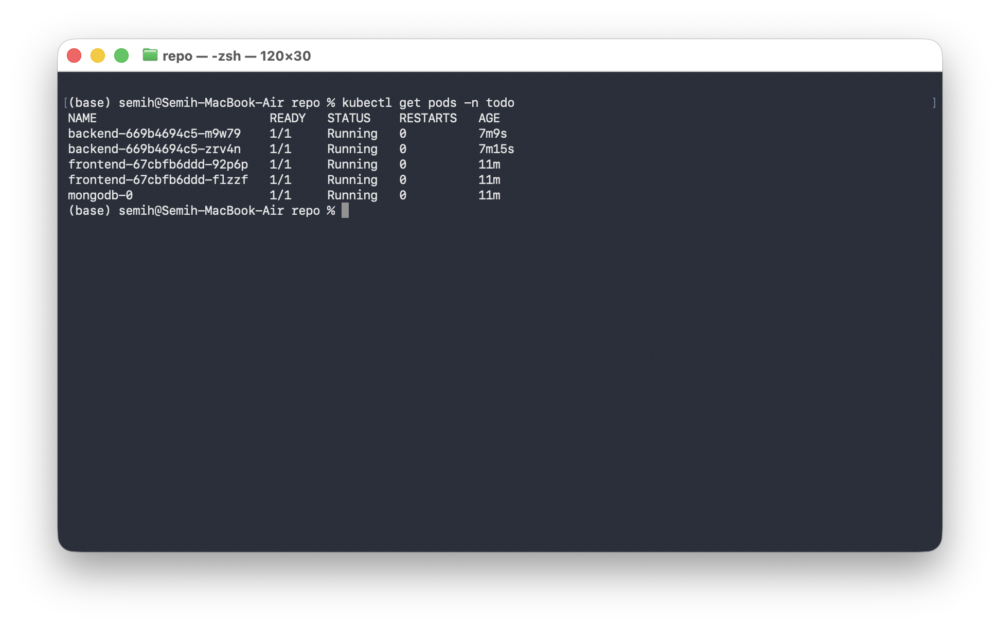
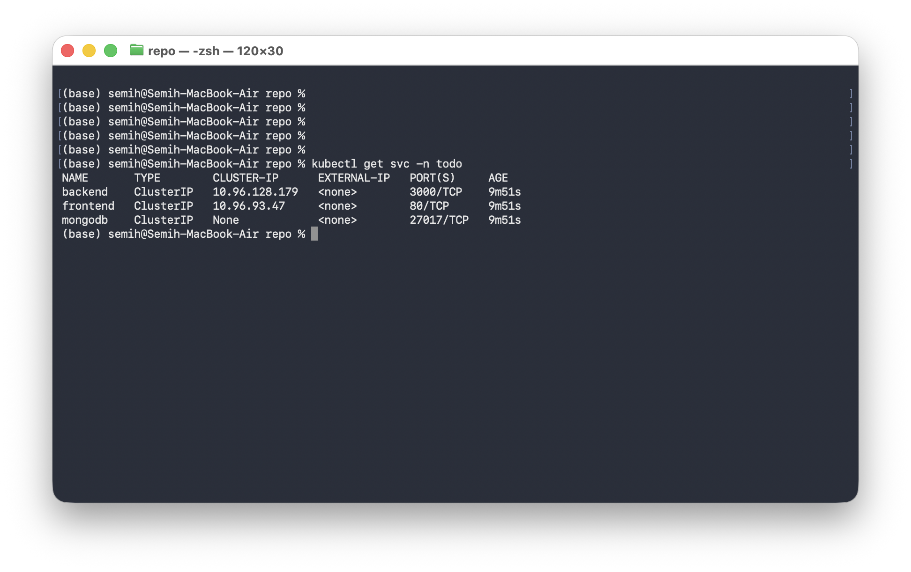
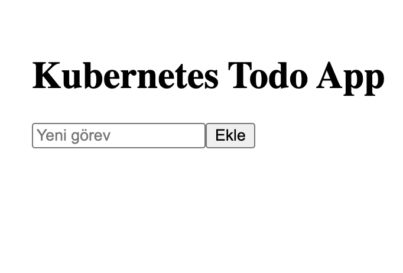

# Kubernetes ToDo App

[](https://github.com/semihdogan0/LogoIntershipKubernets_ToDo/actions)

React + Node.js + MongoDB tabanlı ToDo uygulamasının Docker ile container'lanıp Kubernetes üzerinde dağıtılması.
**Logo Yazılım DevOps Stajı — 2 kişilik ekip projesi**

---

## Proje Amacı

Kubernetes'in temel bileşenlerini uçtan uca bir uygulama üzerinde öğrenmek ve uygulamak.

**Kapsanan konular:** Pod · ReplicaSet · Deployment · Service · Ingress · ConfigMap · Secret · PersistentVolumeClaim · Probe'lar · Resource limits · Rolling Update · Rollback · Scaling

---

## Mimari

```
                    ┌──────────────────────┐
   Browser ────────▶│  Ingress (nginx)     │
                    │  todo.local          │
                    └──────┬───────────┬───┘
                       /   │           │  /api
                  ┌────────▼───┐  ┌────▼────────┐
                  │  frontend  │  │  backend    │
                  │  React     │  │  Node.js    │
                  │  Deploy ×2 │  │  Deploy ×2  │
                  └────────────┘  └──────┬──────┘
                                         │
                                  ┌──────▼──────┐
                                  │  MongoDB    │
                                  │ StatefulSet │
                                  │  + PVC 1Gi  │
                                  └─────────────┘

Namespace: todo
```

---

## Teknolojiler

| Katman | Teknoloji |
|---|---|
| Frontend | React (Vite), nginx ile servis |
| Backend | Node.js + Express |
| Veritabanı | MongoDB 7 |
| Container | Docker (multi-stage build) |
| Orkestrasyon | Kubernetes (kind) |
| CI/CD | GitHub Actions + GHCR |

---

## API Sözleşmesi

| Method | Path | Gövde | Yanıt |
|---|---|---|---|
| GET | `/api/todos` | — | `[{_id, title, done}]` |
| POST | `/api/todos` | `{title}` | 201 + kayıt |
| PUT | `/api/todos/:id` | `{done}` | 200 + kayıt |
| DELETE | `/api/todos/:id` | — | 204 |
| GET | `/healthz` | — | `ok` (liveness) |
| GET | `/readyz` | — | Mongo ping (readiness) |

---

## Proje Yapısı

```
.
├── .github/workflows/ci.yml
├── frontend/
│   ├── Dockerfile
│   ├── nginx.conf
│   └── src/
├── backend/
│   ├── Dockerfile
│   ├── server.js
│   └── package.json
├── k8s/
│   ├── 00-namespace.yaml
│   ├── 01-secret.yaml
│   ├── 02-configmap.yaml
│   ├── 03-mongodb.yaml      # StatefulSet + headless Service + PVC
│   ├── 04-backend.yaml      # Deployment + Service
│   ├── 05-frontend.yaml     # Deployment + Service
│   └── 06-ingress.yaml
├── scripts/kind-up.sh
├── docs/runbook.md
└── images/
```

---

## Kurulum

### Ön Koşullar

`docker` · `kubectl` · `kind`

### 1. Cluster'ı ayağa kaldır

```bash
./scripts/kind-up.sh
echo "127.0.0.1 todo.local" | sudo tee -a /etc/hosts
```

### 2. Image'ları build et ve cluster'a yükle

```bash
docker build -t todo-backend:v1 ./backend
docker build -t todo-frontend:v1 ./frontend

kind load docker-image todo-backend:v1 --name todo
kind load docker-image todo-frontend:v1 --name todo
```

> `kind load` adımı zorunlu. Aksi halde kind kendi container registry'sinde image'ı bulamaz ve pod `ErrImagePull` verir.

### 3. Deploy et

```bash
kubectl apply -f k8s/
kubectl wait --for=condition=ready pod --all -n todo --timeout=180s
```

### 4. Aç

http://todo.local

---

## Doğrulama

```bash
kubectl get all -n todo
kubectl get pvc -n todo
kubectl describe ingress todo -n todo
```

---

## Ölçekleme (Scaling)

```bash
kubectl scale deployment backend --replicas=5 -n todo
kubectl get pods -n todo -w
```

---

## Rolling Update

Deployment `maxUnavailable: 0` ile yapılandırıldığı için güncelleme sırasında kesinti olmaz.

```bash
# Ayrı bir terminalde kesinti izleyicisi
while true; do curl -s -o /dev/null -w "%{http_code} " todo.local/healthz; sleep 0.2; done

# Yeni sürümü çıkar
docker build -t todo-backend:v2 ./backend
kind load docker-image todo-backend:v2 --name todo
kubectl set image deployment/backend backend=todo-backend:v2 -n todo
kubectl rollout status deployment/backend -n todo
```

## Rollback

```bash
kubectl rollout history deployment/backend -n todo
kubectl rollout undo deployment/backend -n todo
```

---

## Kullanılan Kubernetes Kaynakları

| Kaynak | Bu projedeki rolü |
|---|---|
| **Namespace** | Tüm kaynaklar `todo` altında izole |
| **Deployment** | frontend ve backend pod'larının sürüm yönetimi |
| **ReplicaSet** | Deployment tarafından yönetilen, istenen replica sayısını koruyan katman |
| **StatefulSet** | MongoDB için sabit kimlik ve kalıcı disk |
| **PersistentVolumeClaim** | Pod silinse de veritabanı verisinin kaybolmaması |
| **Service** | ClusterIP ile pod'lar arası servis keşfi |
| **Ingress** | Tek giriş noktası, path bazlı yönlendirme (`/` → frontend, `/api` → backend) |
| **ConfigMap** | Hassas olmayan yapılandırma (DB adı, port) |
| **Secret** | MongoDB kullanıcı adı/şifresi |
| **Liveness / Readiness Probe** | Ölü pod'un yeniden başlatılması, hazır olmayan pod'a trafik gitmemesi |
| **Resource requests/limits** | Bir pod'un node'u tüketmesini engelleme |
| **Rolling Update** | Sıfır kesintili sürüm geçişi |

---

## Görev Dağılımı

| Alan | Sorumlu |
|---|---|
| Backend API + Dockerfile | Kişi A |
| Frontend + Dockerfile + nginx config | Kişi B |
| MongoDB StatefulSet, Secret, ConfigMap | Kişi A |
| Deployment / Service / Ingress | Kişi B |
| GitHub Actions CI | Kişi A |
| Rolling update & rollback testi, runbook | Kişi B |

Her PR karşı taraf tarafından review edilir; `main`'e doğrudan push kapalıdır.

---

## Ekran Görüntüleri

### Pod Listesi


### Service Listesi


### Uygulama


### Rolling Update


---

## Öğrenilen Konular

- Multi-stage Docker build ile küçük ve güvenli image üretimi
- Kubernetes kaynak modeli: Pod → ReplicaSet → Deployment ilişkisi
- Stateless (Deployment) ve stateful (StatefulSet + PVC) iş yükleri arasındaki fark
- Servis keşfi ve Ingress ile dış dünyaya açılma
- Yapılandırma yönetimi: ConfigMap ve Secret ayrımı
- Probe'lar ile sağlık kontrolü ve sıfır kesintili dağıtım
- Rolling update ve rollback stratejileri
- Yatay ölçekleme
- GitHub Actions ile image build ve registry'ye push

---

## CV Açıklaması

> React, Node.js ve MongoDB tabanlı bir ToDo uygulamasını multi-stage Docker build ile container'layıp Kubernetes üzerinde dağıttım. Deployment, StatefulSet, Service, Ingress, ConfigMap ve Secret kaynaklarını yapılandırdım; liveness/readiness probe'ları ve resource limitleri tanımlayarak `maxUnavailable: 0` ile sıfır kesintili rolling update ve rollback senaryolarını doğruladım. GitHub Actions ile image build ve GHCR'ye push eden bir CI hattı kurdum.

---

## Ekip

- [Semih Doğan](https://github.com/semihdogan0)
- [Takım arkadaşı]
